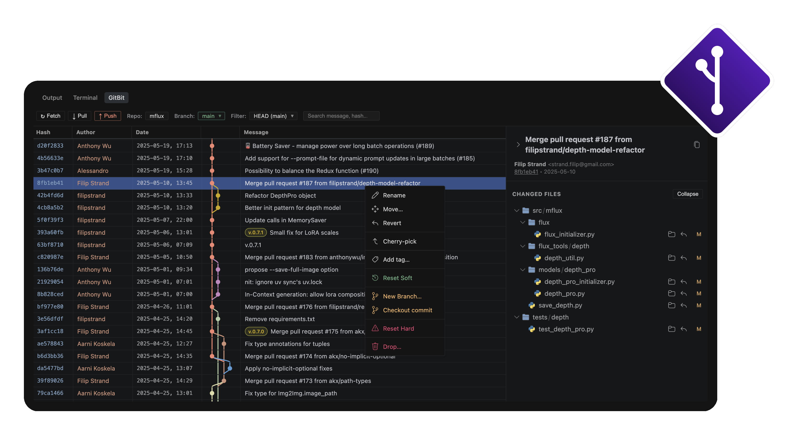

# GitBit

  

A simple, powerful Git Graph for Cursor and VS Code, inspired by JetBrains IDEs.

GitBit provides a lightweight and performant way to visualize your repository's history, manage branches, and perform complex Git operations like squashing directly from a beautiful graph interface.

## ✨ Features

- **Clean Graph**: A clean, topological visualization of your local and remote commits.
- **Side-by-Side Details**: Instantly see commit metadata and changed files in a dedicated details pane.
- **Advanced Squashing**: Select a range of commits and squash them with a single click, including automatic rebasing and commit message prompts.
- **Drop Commits**: Select one or multiple commits and drop them safely (with confirmation + automatic rollback on failure).
- **Branch Management**: Effortlessly switch branches, create new ones, and see your current context at a glance.
- **Tag Management**: Add tags to commits, delete tags via a flyout submenu, and push tags even when your branch is up to date.
- **Integrated Diff View**: Deep integration with native VS Code diffing for a seamless experience.
- **Reveal in Finder**: Reveal changed files in Finder/Explorer from the details pane.
- **Move Mode**: Reorder history with a drag-and-drop “move mode” UI.
- **Performance First**: Optimized for repositories of all sizes, with a focus on smooth scrolling and interaction.
- **Theme-Aware**: Automatically matches your Cursor or VS Code theme.

## 💡 Feature Requests

- **Infinite Scroll**: Fetch more than 500 commits automatically when scrolling to the bottom of the graph.
- **Branch Existence Check**: Show a popup notification if trying to create a branch that already exists.
- **Auto-Rebase on Pull**: Automatically perform a rebase during pull if it can be done safely.

## 🚀 Getting Started

### Installation

- **Marketplace (recommended)**: Open the Extensions marketplace in Cursor or VS Code, search for **GitBit**, and click **Install**.
- **Manual (.vsix)**:
  1. Download the latest `.vsix` from the [Releases](https://github.com/filipstrand/gitbit/releases) page.
  2. Open Cursor or VS Code.
  3. Install the `.vsix` file:
     - **Method 1**: Open the Command Palette, type **"Extensions: Install from VSIX..."**, and select your downloaded file.

### Usage

Once installed, GitBit will appear as a **GitBit** tab in your bottom panel (alongside Terminal and Output). 

- **Click a commit**: View its details and changed files on the right.
- **Right-click**: Access actions like Rename, Move, Cherry-pick, Drop, Branch/Tag actions, and resets.
- **Cmd/Shift + Click**: Select a range of commits to preview a squash.

For a detailed list of changes by version, see [`CHANGELOG.md`](./CHANGELOG.md).

## 🐛 Known Bugs

- Weird behavior sometimes when committing and getting `ruff` errors.
- Sometimes new files generated by agent do not show up in diff view (investigating staged vs unstaged behavior).
- **Context Menu Positioning**: The right-click menu can sometimes go off-screen when opened near the bottom of the window.
- **Rebase Reset**: Encountering issues when trying to perform a reset after a rebase operation.

## 🛠 Development

### Building from Source

If you want to build the extension yourself:

1. Clone the repository.
2. Run `npm install`.
3. Run `npm run package` to compile the source and bundle the webview.
4. Run `npx @vscode/vsce package` to generate the `.vsix` file.

### Contributing

- Open the repo in Cursor/VS Code and press `F5` to start the **Extension Development Host**.
- For technical details, see the source code in `src/`.

## 📄 License

This project is licensed under the MIT License - see the [LICENSE](./LICENSE) file for details.
